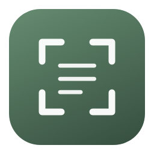

# Smart Clipboard



A native SwiftUI/AppKit menu bar app for macOS 14 or later. Capture a rectangle or window, then keep the image or convert it into editable content with OpenAI.

## Download and install

**[Download v0.2.0 preview](https://github.com/colombod/smart-clipboard/releases/tag/v0.2.0)** · Apple Silicon (M1 or newer) · macOS 14+

1. Download the `.dmg`, open it, and drag **Smart Clipboard** to **Applications**.
2. Eject the disk image and open the installed app. Look for the capture-frame icon in the menu bar.
3. Allow Screen Recording when you first capture. Choose your OpenAI connection in Settings.
4. Enable **Settings → General → Launch at login** if you want it to start automatically.

This initial preview is **ad-hoc signed and not Apple-notarized**. If macOS blocks opening it, review [Apple’s instructions](https://support.apple.com/en-us/102445) and use **System Settings → Privacy & Security → Open Anyway** only if you trust this download. Managed Macs may disallow that exception. A Developer ID certificate and notarization are needed for a future release without this extra step.

A ZIP is also available; extract it and move the app into Applications. `SHA256SUMS.txt` on the release page provides checksums. Intel Macs are not supported by this first binary release. See [the complete installation guide](docs/INSTALL.txt) for setup, updates and removal.

The app uses a green capture-frame icon, native system backgrounds/text and a forest-green accent. Windows follow the Mac’s light/dark appearance automatically.

## Build from source

```sh
./scripts/build-app.sh
open 'dist/Smart Clipboard.app'
```

Requires Apple Command Line Tools (`xcode-select --install`), Swift 6 or later, and no third-party Swift dependencies. Open `Package.swift` in Xcode to work on the app. The build script creates an ad-hoc-signed app for local use. Set `SIGNING_IDENTITY` to sign with your own identity; a release that passes Gatekeeper without a manual exception also needs Developer ID signing and notarization.

Move the built app into `/Applications` before enabling **Settings → General → Launch at login**. The app opens its capture panel on first launch, then runs in the menu bar without a Dock icon. Closing a window leaves the app running; Quit is in the menu bar menu.

## Capture and convert

- **⌥⇧⌘3**: capture a rectangle.
- **⌥⇧⌘4**: start in window selection mode.
- Press **Space** during capture to switch modes; **Escape** cancels.
- Configure both global shortcuts in Settings → Shortcuts. Conflicts are reported and the previous shortcut is restored.
- Choose Image, Description, Plain text, Markdown, HTML, SVG, JSON, YAML, or Pick it for me.
- Add an optional instruction, such as “Translate to English” or “Use one record per table row.”
- Choose **Convert with AI**, or **Extract text on device** for offline Apple Vision OCR. Local OCR ignores AI directions and always returns plain text.
- Edit the output, copy it, or save it using the format’s file extension. The original PNG remains available independently.

macOS requests Screen Recording permission at first capture. Grant it in System Settings → Privacy & Security → Screen & System Audio Recording, then restart the app if needed. Capture uses the built-in macOS interactive screenshot selector, including multi-display selection. `screencapture` receives only the selected region/window; there is no continuous screen monitoring.

## Pick it for me and capture history

Choose **Pick it for me** in the output sidebar, or set it as **Settings → General → Default output**. On conversion, AI chooses an editable format from the original source: plain text for prose, Markdown for documents/tables, JSON or YAML for records/configuration, HTML for web layouts, SVG for simple diagrams, or a description for photos. The result shows the actual chosen format. You can override it any time.

Open **History** from the sidebar or menu bar. Entries show a thumbnail, capture date, and saved formats. Select **Open**, pick a different output format, and convert the original image again. **Saved formats** retrieves a previous result without a new AI request. Each capture keeps the latest result per format; regenerating one format leaves the others intact. Editor changes are saved when switching clips/results, copying/exporting, starting another conversion, closing the working clip, or quitting normally.

In **Settings → History**, set the maximum clip count (0–500, default 50), then click **Apply limit**. Oldest captures and their original image files are removed first. Zero clears saved clips and disables history for future captures. Use the trash button on an entry to delete it, or **Clear history** to remove all captures/results and close the active clip. Deletions do not erase exported files or the system clipboard.

Storage: `~/Library/Application Support/Smart Clipboard/History/`. Original PNGs are stored alongside a metadata/result index. Files are restricted to your macOS user (folder 0700, files 0600), but are not separately encrypted by the app. History is only for captures and images imported into Smart Clipboard; it does not monitor the system clipboard. The limit counts captures, so disk usage depends on image sizes; Settings also shows the current disk usage.

## Connect to OpenAI

**API key:** In Settings → Connection, choose OpenAI API key, paste a key, and save it. Keys are stored in macOS Keychain. The editable default model is `gpt-5.6-luna`; choose an image-capable model supporting structured outputs available to your API account. Requests use the Responses API with a JSON schema and `store: false`. API usage is billed separately through OpenAI Platform.

**ChatGPT subscription:** Install a recent official Codex CLI, select ChatGPT via Codex, then click Sign in with ChatGPT and complete the browser flow. Alternatively, an existing `codex login` session works. Check connection verifies that Codex reports a ChatGPT login. The CLI must support `--ignore-user-config` (update it if necessary). An optional executable path handles nonstandard installations; an empty model uses the CLI's built-in default.

The subscription integration invokes the official CLI's non-interactive image support; it is not a standalone ChatGPT OAuth client or an API billing workaround. Availability and limits depend on the account’s Codex entitlement and workspace policies. Credentials remain managed by Codex. The app checks login type, forces ChatGPT auth for conversions, strips inherited API keys from the child environment, and does not read authentication files.

Codex conversions use a private temporary working directory, ephemeral sessions, read-only sandbox, no user config, disabled shell/patch/collaboration features and disabled web search. No plugins or MCP servers from the user's config are loaded. A conversion is image analysis only; temporary captures/results are removed when the operation ends. Cancellation terminates the child process. Do not use an untrusted replacement for the configured executable.

Official references: [Authentication](https://learn.chatgpt.com/docs/auth), [Non-interactive Codex](https://learn.chatgpt.com/docs/non-interactive-mode), [Image input](https://developers.openai.com/api/docs/guides/images-vision).

## Privacy and output behavior

Captures remain local until **Convert with AI** is chosen. Image copy/save and local OCR work without a connection. By default, the app saves the 50 most recent captures/imports and their generated results locally. Change this in Settings → History; setting the limit to zero removes saved history and disables future saving. Exporting explicitly writes a file; copying explicitly updates the system clipboard. Saved history survives quitting the app. Close a working clip with the × button without deleting its history; delete an entry in History or use Clear history to remove saved originals and results. The system clipboard and exported files survive app exit. OpenAI data handling follows the selected API account or ChatGPT workspace policy; `store: false` does not imply zero retention.

AI extraction and vector reconstruction can be imperfect. Screenshot instructions are treated as untrusted data. JSON is validated before acceptance; YAML/HTML/SVG are returned as editable source, not rendered or executed, and require review for correctness. Copying output uses plain-text clipboard content, including markup formats. Large or complex captures may exceed model limits; try a smaller region.

## Validate

```sh
./scripts/test.sh
```

The 31 tests cover conversion envelopes, output selection, JSON validity, refusals/truncation, Responses API payloads, child-process cancellation/timeouts, on-device OCR against a generated fixture, history persistence/eviction/deletion, and converting a reopened capture from its original image. Run the OCR test outside restrictive automation sandboxes so Vision can access macOS image buffers. Live AI calls require a configured account. macOS screen permissions, interactive selection and login-item approval require testing in a logged-in GUI session. Project task tracking lives in Beads (`bd`).

## Package a release

```sh
./scripts/package-release.sh
```

This builds for the current Mac’s architecture and writes a DMG, ZIP, and SHA-256 checksums into `dist/`. The DMG includes the app, an Applications shortcut, and installation instructions. The capture-frame application icon is generated from vector drawing code in `scripts/generate-icon.swift`.

The current preview has passed its 31 automated tests and release-build/signature checks. Interactive capture across multiple displays, login-item approval and live API/ChatGPT conversions still need hands-on acceptance testing with configured accounts. No credentials, captures, local issue database, or compiled build cache are published in source.
