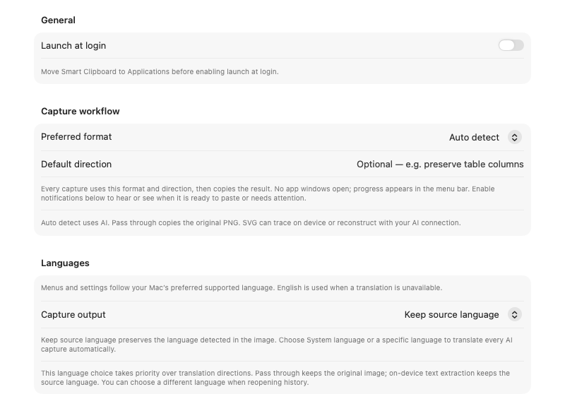
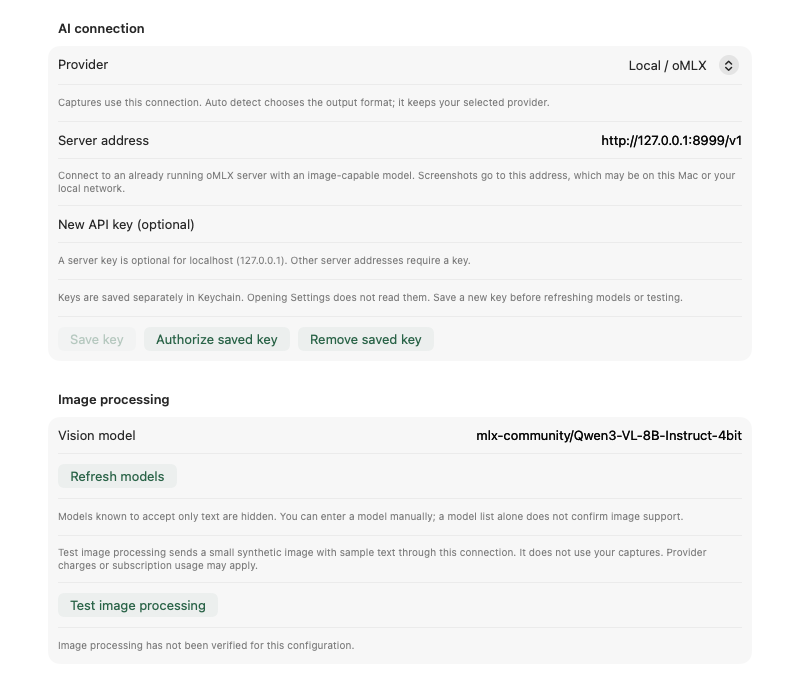
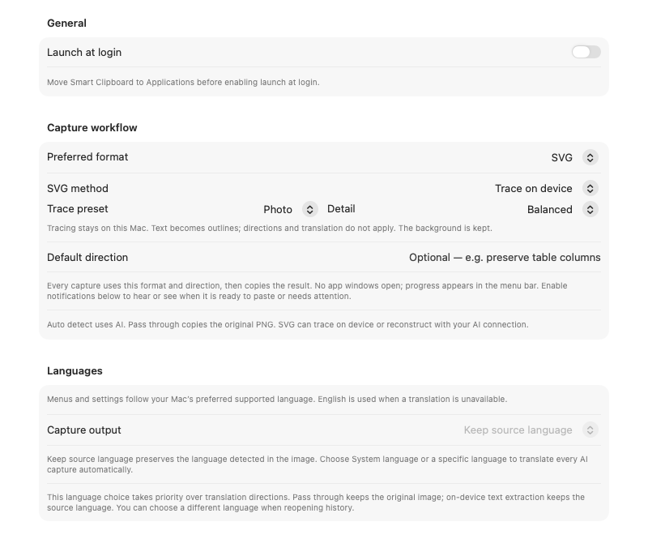
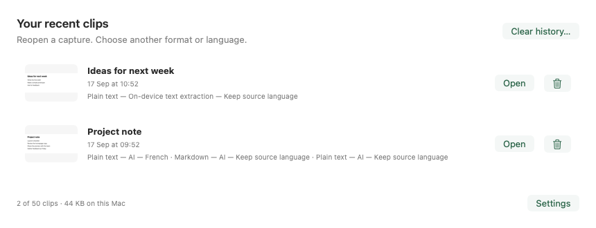
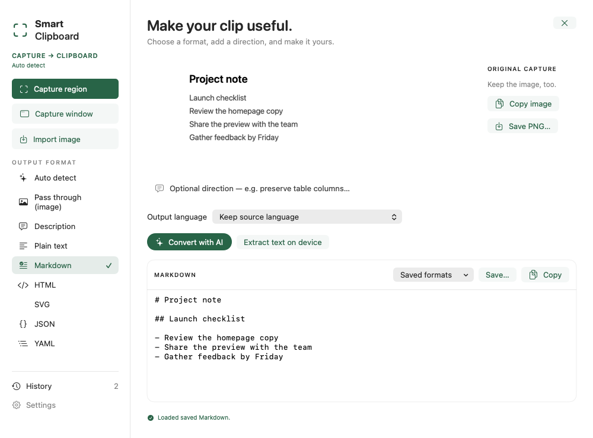

# Utiliser Smart Clipboard

**Réglez une fois. Capturez. Attendez Clip ✓. Collez.** L’app reste dans la barre des menus jusqu’à ce que vous souhaitiez l’ouvrir.

Guide de la **[0.4 en préversion, build 15](https://github.com/colombod/smart-clipboard/releases/tag/v0.4.0-preview.15)**. Les images montrent les vues actuelles en anglais avec des données d’exemple ; sélectionnez-les pour les agrandir.

Accès rapide : [IA locale](#configurer-omlx), [vectorisation](#vectoriser-une-image), [traduction](#langues-et-traduction) ou [dépannage](#si-la-capture-ne-fonctionne-pas).

## Installer et démarrer

1. [Téléchargez le DMG signé](https://github.com/colombod/smart-clipboard/releases/download/v0.4.0-preview.15/Smart-Clipboard-0.4.0-macOS-arm64.dmg), ouvrez-le et glissez **Smart Clipboard** dans **Applications**.
2. Éjectez le DMG, lancez l’app installée et repérez **Clip** dans la barre des menus. Aucune icône dans le Dock ni fenêtre à garder ouverte.
3. Ouvrez **Clip → Réglages et état…**. Activez **Ouvrir à la session** dans Général pour retrouver l’app au démarrage du Mac.

Nécessite Apple Silicon et macOS 14 ou ultérieur. Fermer les réglages laisse les raccourcis actifs ; **Clip → Quitter Smart Clipboard** arrête l’app.

## Capturer, attendre, coller

| Étape | Action |
| --- | --- |
| **Capturer une zone** | Appuyez sur **⌃⌘R** et tracez un rectangle. |
| **Capturer une fenêtre** | Appuyez sur **⌃⌘W**, puis cliquez sur la fenêtre. |
| **Attendre** | **Clip …** devient **Clip ✓** quand le résultat est copié. |
| **Coller** | Faites **⌘V** dans l’app de destination. |

**⌃⌘R** signifie maintenir **Contrôle + Commande** et appuyer sur **R** ; **⌃⌘W** utilise **W**. Ces réglages par défaut commencent avec le build 15. Les raccourcis enregistrés, y compris ceux d’anciennes versions, restent prioritaires. Consultez-les ou enregistrez-en d’autres dans **Réglages → Raccourcis**. **Espace** change de mode ; **Échap** annule. Un échec ou une annulation conserve le contenu précédent du presse-papiers.

Autorisez l’enregistrement de l’écran lorsque macOS le demande, ou utilisez **Demander l’accès à l’écran** dans Raccourcis. Rouvrez l’app si macOS le demande. Une capture n’ouvre ni les réglages ni l’éditeur.

## Choisir le format

*Réglages → Général s’applique aux nouvelles captures. L’historique propose des choix séparés pour retraiter les images enregistrées.*

| Format préféré | Résultat |
| --- | --- |
| **Détection automatique** | L’IA choisit un format modifiable à partir de l’image. |
| **Image seule (originale)** | L’image d’origine, sans extraction ni IA. |
| **Texte brut / Markdown** | Texte, notes, titres ou tableaux modifiables. |
| **JSON / YAML / HTML** | Données structurées ou code de balisage. |
| **SVG** | Vectorisation locale des formes ou reconstitution par IA. |
| **Description** | Une description écrite de l’image. |

**Consigne par défaut** ajoute des instructions, par exemple « Conserver les colonnes du tableau ». Les résultats IA, HTML et SVG sont copiés sous forme de texte ; l’app n’affiche ni n’exécute le balisage généré. Vérifiez le résultat avant de l’utiliser.

## Configurer oMLX

*Choisissez Local / oMLX, indiquez l’adresse de votre serveur et sélectionnez un modèle capable de lire les images.*

1. Installez et lancez [oMLX](https://github.com/jundot/omlx). Pour commencer, téléchargez **mlx-community/Qwen3-VL-8B-Instruct-4bit**.
2. Dans **Réglages → Connexion**, choisissez **Local / oMLX**. L’adresse doit se terminer par `/v1` ; `http://127.0.0.1:8999/v1` est un exemple, pas un port universel.
3. Cliquez sur **Actualiser les modèles** et sélectionnez l’identifiant exact du modèle visuel. Le serveur peut omettre le préfixe `mlx-community/`.
4. Si une clé est nécessaire, saisissez-la et cliquez sur **Enregistrer la clé**. Un serveur sur un autre ordinateur exige une clé ; utilisez HTTPS hors d’un réseau local privé.
5. Cliquez sur **Tester le traitement d’images**. Le test utilise une image générée, pas votre écran. Choisissez ensuite le format dans Général et fermez les réglages.

Laissez oMLX ouvert pour l’extraction par IA. Smart Clipboard ne télécharge pas les modèles, ne lance pas le serveur et ne bascule pas vers le cloud en cas d’échec. **Vectoriser sur cet appareil** et **Image seule** fonctionnent sans oMLX.

### Choisir un modèle local

Commencez par **Qwen3-VL-8B-Instruct-4bit** pour le texte, les tableaux et la traduction. Le modèle **32B**, plus volumineux, n’a pas corrigé les erreurs de Description/SVG dans nos tests. Pour vectoriser une image, choisissez **Vectoriser sur cet appareil** : aucun modèle nécessaire.

Le serveur testé est la version officielle **[oMLX 0.7.0.dev2](https://github.com/jundot/omlx/releases/tag/v0.7.0.dev2)**. La 0.6.4 présente un défaut de sortie structurée avec ce modèle ; un modèle plus gros ne le corrige pas. Ces tests ne couvrent pas les versions ultérieures du serveur.

Taille, mémoire et résultats des tests

Il s’agit de conversions MLX Community en 4 bits de modèles Qwen capables de lire les images. Utilisez l’identifiant complet dans l’outil de téléchargement oMLX :

| Modèle | Téléchargement | Résultats au 22 septembre 2026 |
| --- | --- | --- |
| [mlx-community/Qwen3-VL-8B-Instruct-4bit](https://huggingface.co/mlx-community/Qwen3-VL-8B-Instruct-4bit) | Environ 5,78 Go d’après la [liste de l’éditeur](https://huggingface.co/mlx-community/Qwen3-VL-8B-Instruct-4bit/tree/main). | Texte, tableaux et données structurées fonctionnaient sur les images synthétiques testées. Description inventait des remarques d’orthographe ; SVG modifiait les proportions, bordures ou dispositions. |
| [mlx-community/Qwen3-VL-32B-Instruct-4bit](https://huggingface.co/mlx-community/Qwen3-VL-32B-Instruct-4bit) | Téléchargement vérifié : 19 636 446 591 octets dans 19 fichiers, soit environ 19,64 Go / 18,29 Gio. | Avec oMLX 0.7.0.dev2, les valeurs étaient conservées, mais Description inventait des alignements et SVG utilisait un mauvais canevas et ajoutait une ligne. Six essais de consignes ont amélioré les dimensions sans corriger contenu et disposition. |

La mesure 32B correspond à la [révision `6e5644d`](https://huggingface.co/mlx-community/Qwen3-VL-32B-Instruct-4bit/tree/6e5644d3ea4b953b5221ffd02339bf897041038a). Il s’agit de tailles sur disque, pas de mémoire utilisée à l’exécution.

**Estimations de mémoire :** prévoyez au moins 16 Go de mémoire unifiée pour 8B ou 48 Go pour 32B, avec une marge pour les grandes images, le contexte et les autres apps. Ce sont des estimations prudentes, pas des minima vérifiés ni des garanties de vitesse. Les tests utilisaient un Mac de 128 Gio ; les Mac moins dotés n’ont pas été validés. Gardez de l’espace pour les caches et commencez avec une petite image sans données privées.

Aucun des deux n’a passé l’évaluation de qualité de tous les formats. Description et SVG restent expérimentaux. Consultez les [preuves des tests locaux](../../testing/OMLX.md) pour distinguer contrôles automatiques et qualité visuelle.

## Autres connexions

Pour **OpenAI**, **Anthropic**, **Google Gemini** ou **Perplexity**, sélectionnez le fournisseur dans Connexion, saisissez la clé API, cliquez sur **Enregistrer la clé**, choisissez un modèle visuel et lancez **Tester le traitement d’images**. L’accès et la facturation API sont distincts des abonnements de chat. Chaque fournisseur conserve ses réglages et sa clé.

Pour **ChatGPT via Codex**, installez ou mettez à jour Codex CLI, puis choisissez **Se connecter avec ChatGPT**. Laissez **Exécutable Codex** vide pour la détection automatique, puis lancez le test d’image. Un compte Codex éligible et la CLI officielle compatible sont nécessaires ; les limites d’abonnement s’appliquent.

Si une clé enregistrée nécessite votre accord après une mise à jour, cliquez sur **Autoriser la clé enregistrée**. Les captures en arrière-plan n’ouvrent pas de dialogue du Trousseau. Toutes les connexions cloud n’ont pas été vérifiées en conditions réelles ; consultez l’[état des fournisseurs](../../PROVIDERS.md).

## Vectoriser une image

*Choisissez explicitement Vectoriser sur cet appareil. Reconstituer avec l’IA reste la méthode par défaut après une mise à jour.*

### Photos, logos et dessins

1. Dans **Réglages → Général**, choisissez **Format préféré → SVG** et **Méthode SVG → Vectoriser sur cet appareil**.
2. Sélectionnez **Photo**, **Logo** ou **Dessin au trait** selon l’image.
3. Commencez avec **Équilibré**. **Détaillé** conserve plus de formes et de couleurs, mais crée des fichiers plus gros.
4. Fermez les réglages, capturez, attendez **Clip ✓**, puis collez.

La vectorisation fonctionne hors ligne avec le composant VTracer inclus : ni clé API, modèle, serveur, ni installation supplémentaire. Elle suit les formes visibles, conserve le fond et transforme les mots en contours. Elle ne traduit pas, ne supprime pas le fond et ne récupère pas les données des graphiques. Les consignes ne s’appliquent pas et un échec ne déclenche aucun recours à l’IA.

**Dans un éditeur vectoriel :** ouvrez la capture dans **Historique**, cliquez sur **Enregistrer…**, puis importez le fichier `.svg`. Un éditeur de texte reçoit le code SVG. Pour les gros SVG, l’app affiche un résumé compact ; **Copier** et **Enregistrer…** conservent le résultat intégral.

### Vectoriser une capture enregistrée

Ouvrez **Clip → Historique → Ouvrir**, choisissez **SVG → Vectoriser sur cet appareil**, réglez le préréglage et le détail, puis cliquez sur **Vectoriser en SVG**. Utilisez **Copier** ou **Enregistrer…**. Chaque combinaison de méthode, préréglage et détail garde son résultat. Ces choix manuels ne changent pas les préférences des captures automatiques.

### Reconstituer avec IA

Choisissez **SVG → Reconstituer avec l’IA** pour faire interpréter et reconstruire un diagramme ou une illustration par votre modèle. Il peut suivre consignes et langue, mais aussi modifier ou inventer des détails. Testez d’abord la connexion et comparez le résultat à l’original.

## Langues et traduction

Dans **Général → Langues → Résultat de capture**, choisissez :

| Choix | Résultat |
| --- | --- |
| **Conserver la langue d’origine** | Garde la langue détectée dans l’image. C’est le choix par défaut. |
| **Langue du système** | Traduit les captures IA dans la langue préférée du Mac. |
| **Une langue précise** | Traduit indépendamment de la langue du Mac. |

Un choix explicite prime sur les consignes de traduction. Les anciens réglages peuvent afficher **Utiliser les consignes enregistrées** jusqu’à ce que vous choisissiez une langue. Les changements valent pour la prochaine capture. Vérifiez traductions et valeurs extraites : la qualité varie selon le modèle.

L’interface suit séparément macOS en anglais, italien, espagnol, français ou allemand, avec l’anglais en repli. Redémarrez l’app après avoir changé sa langue. **Image seule**, la vectorisation locale et **Extraire le texte sur l’appareil** ne traduisent pas. En mode langue d’origine, les descriptions utilisent l’anglais si aucun texte lisible ne permet d’identifier la langue.

## Réutiliser les captures

*L’original et ses versions restent ensemble. Ouvrir l’historique ne change pas le presse-papiers.*

Cliquez sur **Ouvrir**, choisissez un autre format ou une **Langue du résultat**, puis **Convertir avec l’IA**. Pour l’OCR hors ligne, choisissez **Extraire le texte sur l’appareil** ; pour les vecteurs, **Vectoriser en SVG**. **Formats enregistrés** charge un résultat sans le traiter à nouveau.

*Cette fenêtre ne s’ouvre que sur demande. Les captures ordinaires sont copiées directement en arrière-plan.*

Cliquez sur **Copier** ou activez **Copier après une conversion manuelle**. Refaire le même format et la même langue remplace seulement cette version ; les autres restent.

Dans **Réglages → Historique**, fixez la limite (50 par défaut, jusqu’à 500), supprimez une entrée ou effacez tout. Zéro vide et désactive l’historique. Les fichiers exportés et le presse-papiers ne changent pas.

## Notifications

Dans **Général → Notifications de capture**, cliquez sur **Activer les notifications** et acceptez la demande de macOS. Choisissez réussite, échec ou les deux ; le son est facultatif. Les avis contiennent seulement l’état et le format. Ils n’ouvrent l’app que si vous cliquez dessus.

| État | Signification |
| --- | --- |
| **Clip …** | Capture ou conversion en cours. |
| **Clip ✓** | Résultat dans le presse-papiers. |
| **Clip !** | Ouvrez le menu pour lire le problème. |

**Clip ✓ sans bannière ?** Vous pouvez coller. Concentration ou partage/enregistrement d’écran peuvent masquer ou couper les alertes même activées. L’app respecte ces réglages. Consultez le [dépannage](#si-la-capture-ne-fonctionne-pas).

## Confidentialité et stockage

L’app ne capture que la zone ou fenêtre demandée ; elle ne surveille pas continuellement l’écran ou le presse-papiers. Les captures IA vont au fournisseur choisi. oMLX sur `127.0.0.1` reste sur ce Mac ; un serveur distant reçoit l’image à distance. La conservation cloud dépend des règles du fournisseur.

Vectorisation locale, image seule et OCR Apple ne nécessitent aucun fournisseur IA. Les clés sont dans le Trousseau macOS ; les identifiants ChatGPT restent avec Codex.

L’historique se trouve dans `~/Library/Application Support/Smart Clipboard/History/`, réservé à votre utilisateur Mac mais sans chiffrement séparé. Les fichiers exportés et le presse-papiers en sont indépendants.

## Mises à jour

Utilisez **Clip → Rechercher des mises à jour…** ou **À propos**. Les vérifications quotidiennes facultatives ajoutent un avis au menu sans ouvrir de fenêtre. Préférences, historique et connexion sont conservés.

Les versions stables sont sélectionnées par défaut. Choisissez **À propos → Versions → Versions stables et préversions** pour recevoir des préversions comme le build 15. Les anciennes apps sans mise à jour intégrée nécessitent un remplacement manuel depuis le DMG officiel.

## Si la capture ne fonctionne pas

| Symptôme | À vérifier |
| --- | --- |
| Le menu Clip est absent | Lancez l’app installée ; une barre chargée peut cacher des icônes. |
| Le raccourci ne répond pas | Vérifiez autorisations et conflits dans **Réglages → Raccourcis**. |
| L’accès à l’écran est toujours demandé | Quittez et rouvrez. Pour une ancienne version de développement, voir ci-dessous. |
| Serveur ou modèle indisponible | Lancez oMLX, vérifiez le port, actualisez les modèles et choisissez un modèle visuel. |
| Texte répété ou conversion inachevée | Vérifiez oMLX : la 0.6.4 présente le défaut décrit plus haut. |
| Une image est collée au lieu du texte | Remplacez Image seule par Détection automatique ou un format texte dans **Format préféré**. |
| L’ancien contenu est collé | Attendez **Clip ✓**. Un échec conserve le presse-papiers précédent. |
| Pas de bannière ni de son | Vérifiez Concentration et le partage/enregistrement. **Clip ✓** signifie toujours prêt. |

Rétablir l’autorisation après une ancienne version de développement

Dans **Réglages Système → Confidentialité et sécurité → Enregistrement de l’écran et de l’audio système**, désactivez puis réactivez uniquement Smart Clipboard. Acceptez de quitter et rouvrir si proposé. Au besoin, supprimez l’ancienne entrée et ajoutez `/Applications/Smart Clipboard.app` avec **+**. Si macOS refuse la suppression, demandez de l’aide pour une réinitialisation propre à cette app ; ne réinitialisez pas les autorisations des autres apps. Réglages et historique sont conservés.

Pourquoi les alertes disparaissent pendant le partage d’écran

macOS peut supprimer bannières et sons pendant le partage, la recopie ou l’enregistrement de l’écran, même sans Concentration. Arrêtez cette session et réessayez. Autoriser les notifications pendant le partage est un choix de confidentialité pour tout le système, pas une obligation pour capturer. L’autorisation de Smart Clipboard ne signifie pas un enregistrement continu.

[Signalez un problème](https://github.com/colombod/smart-clipboard/issues/new) en indiquant build, version de macOS, fournisseur/modèle et erreur du menu. Excluez clés et captures privées. Consultez aussi l’[état de l’accessibilité](../../ACCESSIBILITY.md) et les [limites de la préversion](../../releases/v0.4.0-preview.md).
